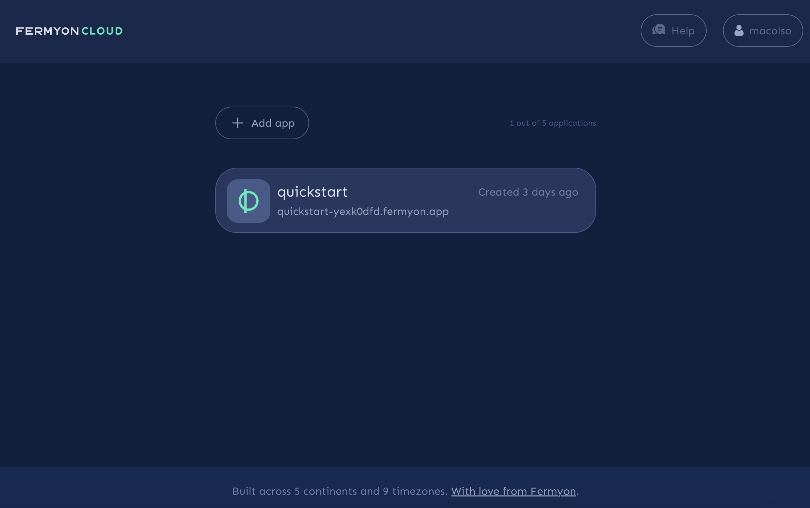
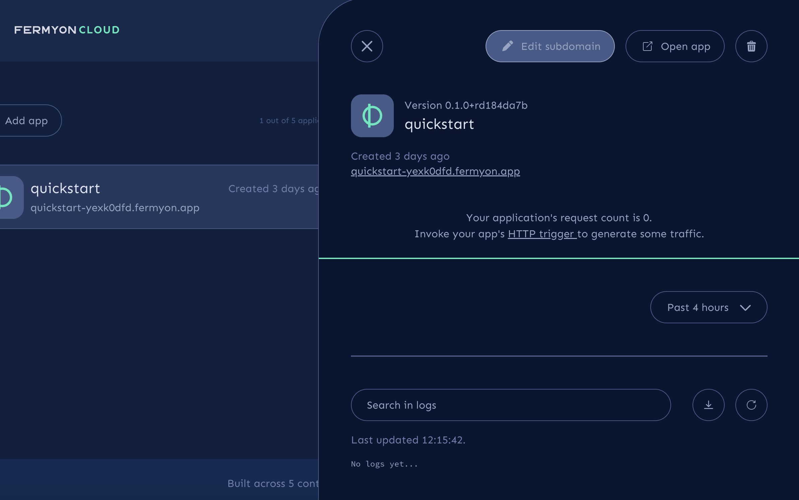
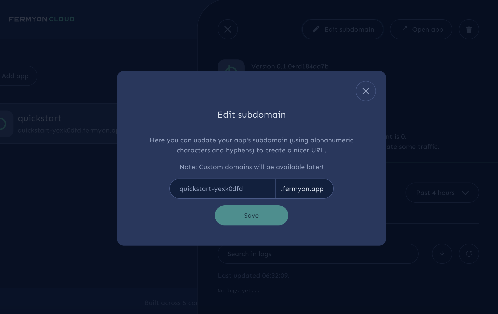
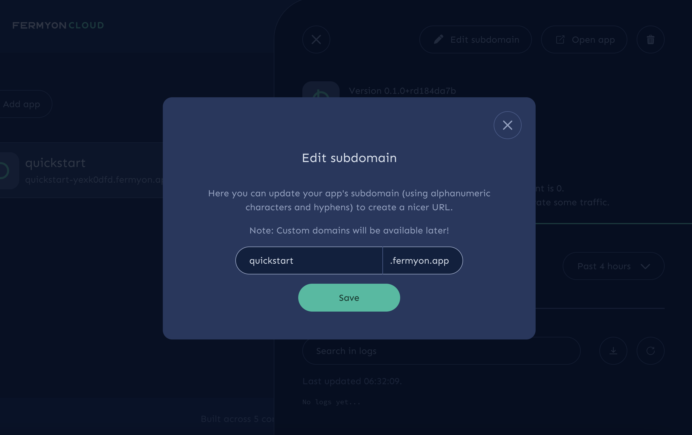
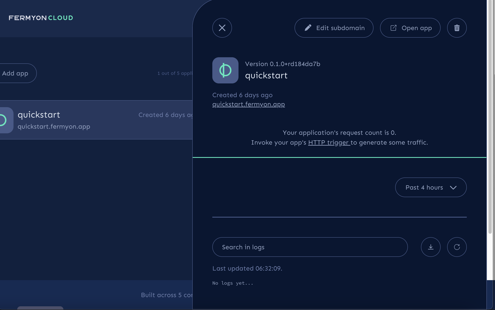

title = "Apply Custom Fermyon Subdomain"
template = "cloud_main"
date = "2022-04-26T00:22:56Z"
enable_shortcodes = false
[extra]
url = "https://github.com/fermyon/developer/blob/main//content/cloud/custom-fermyon-subdomain.md"

---
- [Log Into Cloud UI](#upgrade-your-application)
- [Select Application]

Every Spin application running on Fermyon Cloud receives a domain name that has the following format: `<your-App-Name-randomlyAssignedString>.fermyon.app`. For a more easily recognizable domain name, you may want to change your Spin application's domain name from `slats-the-cat-o7jecuug.fermyon.app` to `slatsthecat.fermyon.app`. 

Custom Fermyon subdomain names allow you to rename the `<your-App-Name-randomyAssignedString>` subdomain. This custom Fermyon subdomain will be combined with the `.fermyon.app` apex domain to give your application a complete domain name. 

## Prerequisites

Log into [Fermyon Cloud](www.cloud.fermyon.com) and ensure you have an Spin application running on Fermyon Cloud. If you do not have a Spin application yet, follow our [quickstart guide](quickstart.md) to deploy one. 



## Select Your Spin Application

Select the application whose domain name you intend to modify. Then select the *Edit Subdomain Name* button in the top right corner.



## Apply New Custom Fermyon Domain

In the text box, you will see your application's current subdomain, followed by the apex domain `fermyon.app`. 



Input your preferred subdomain name that meets the following characteristics:

- character length is at least 3 
- character length is less than 63 characters
- subdomain name is unique 

Then click save to apply your changes. 



## Validate Custom Fermyon Subdomain Name

If you view the application's domain name in the panel view, you should see it has been updated to reflect your custom Fermyon subdomain name:


Visit the application's domain name to validate the change has been applied successfully.

<!-- @selectiveCpy -->

```bash
$ curl quickstart.fermyon.app


```

## Next Steps

Congratulations, you have successfully applied a custom Fermyon subdomain to your Spin application. 

- [Delete an application](delete)
- Find known issues and file new ones with on the [Fermyon Cloud Feedback GitHub repository](https://github.com/fermyon/feedback)
