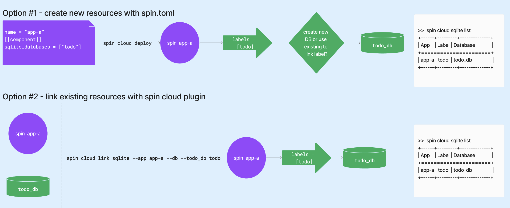

title = "Linking Applications to Resources"
template = "cloud_main"
date = "2023-10-30T00:22:56Z"
enable_shortcodes = true
[extra]
url = "https://github.com/fermyon/developer/blob/main/content/cloud/labels.md"

---
- [Linking Applications to Resources](#linking-applications-to-resources)
- [Benefits of Linking](#benefits-of-linking)
- [Working With Links](#working-with-links)
- [Next Steps](#next-steps) 

# Linking Applications to Resources Using Labels

Spin applications are inherently ephemeral resources; therefore, state needs to be persisted in external stores such as NoOps SQL Databases. To do this, Spin applications need a way to refer to these external resources. As your workload grows into a distributed system, you will likely have multiple applications connecting to the same NoOps SQL Database with different names as they don't necessarily know or need to care about the terms used by the other.

This is where Fermyon Cloud **links** and **labels** are useful. As a Spin application developer, you provide a label whenever you fill out the name for a NoOps SQL databases in the  component manifest. Let's walk through a specific example together. 

```toml
<...>
name = "todo-app"
[component]
id = "todo"
sqlite_databases = ["data"]
<.../>
```

The string "data" is a **label** which will be used by the Spin application to reference the NoOps SQL Database. At application deployment time, we will **link** the label to a specific NoOps SQL Database instance. 

```bash
spin cloud deploy
Uploading todo-v2 version 0.1.0-r88287985 to Fermyon Cloud...
Deploying...
App "todo-app" accesses a database labeled "data"
Would you like to link an existing database or create a new database?: Use an existing database and link app to it
Which database would you like to link to todo-v2 using the label "data": todo_data
App "todo-app" accesses a database labeled "data"
```

Let's kick things up a notch and deploy a second Spin application that will also use the todo_data database.

```toml
<...>
name = "api-app"
[component]
id = "todo"
sqlite_databases = ["defeault"]
<.../>
```

The second Spin application is using its own label, default. 

```bash
spin cloud deploy
Uploading api-app version 0.1.0-r88287985 to Fermyon Cloud...
Deploying...
App "api-app" accesses a database labeled "default"
Would you like to link an existing database or create a new database?: Use an existing database and link app to it
Which database would you like to link to todo-v2 using the label "default": todo_data
App "api-app" accesses a database labeled "data"
```

Now we have two seperate Spin applications using their own labels can link to the same logical resource. 

As illustrated in this example, links and labels are application scoped. Whenever that Spin application needs to access that resource, it will use the label as reference. This also means a NoOps SQL DB can be linked to multiple Spin applications which all use their own respective labels.

The Spin application does not need to know the true name of the resource it's interacting with. This also means a label is well understood by all the components within it's respective application, but it doesn't hold any significance to other applications. 

> At this time, only NoOps SQL DB supports labels. However, in the future other Fermyon Cloud resources such as Key Value Store will support links and labels as well. 

## Benefits of Links and Labels

Benefits of the Fermyon Clould links and labels include:

* **Easy Sharing**: Share your Fermyon Cloud resource across applications effortlessly.
* **Resource Creation Control**: You decide when to create and delete Fermyon Cloud resources.
* **Flexible Lifecycle Management**: Manage Fermyon Cloud resources independently of your Spin application.
* **Seamless Cloud Integration**: Cloud experience smoothly integrates with local Spin development, no runtime configuration changes required. 
* **Dynamic App Resource Configuration**: Change the data resource your application points to without rebuilding it.

## Working With Links and Labels

Whenever you add a string to your NoOps SQL database entry in the component manifest, you're creating a label. When you deploy your Spin application to Fermyon Cloud, you'll be prompted to link the label to a specific NoOps SQL database instance. Later on, if you'd like to update the link you can do so via the `spin cloud link` command. 



To see your existing labels, you will need to use the `spin cloud` plugin along with the subcommand of the resource you've linked to your Spin application via a label. For example, if you'd like to see the labels you created for your NoOps SQL DB resources, you'd run the following command:

```bash
$ spin cloud sqlite list
+------+---------+--------------+
| App  | Label   | Database     |
+===============================+
| todo | data    | todo_db      |
|------+---------+--------------|
| api  | default | todo_db      |
+------+---------+--------------+
```

Now you can see your Spin applications, their respective labels and their connected NoOps SQL Databases. In the example above, we have two unique Spin applications (todo and api) that are linked to the same NoOps SQL Database instance (todo-db) via their respective labels (data and default). 

If you'd like to change your link while your Spin application is running, you can do so with the following command:

```bash
spin cloud sqlite unlink --app api-app default
```

Now we've successfully unlinked our api-app from default, which was referencing the todo_data database. 

If you choose to delete your Spin application without unlinking, you are deleting the link and label as well. This act has no impact on the NoOps SQL Database that was previously linked to the Spin application.

## Next Steps

* Review the [NoOps SQL DB Tutorial](noops-sql-db.md) to learn how to use links and labels with your NoOps SQL DB
* Visit the [Spin Cloud Plugin](cloud-command-reference.md) reference article to learn more about the `spin cloud sqlite link` commands